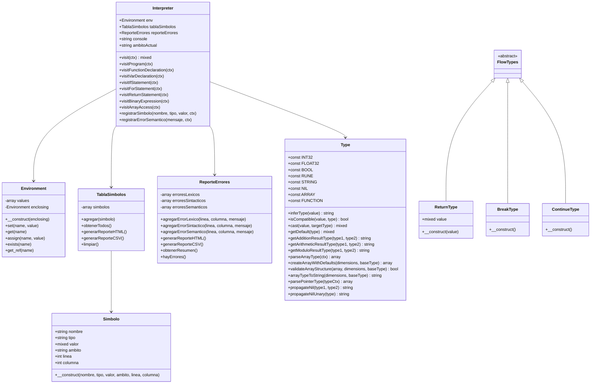
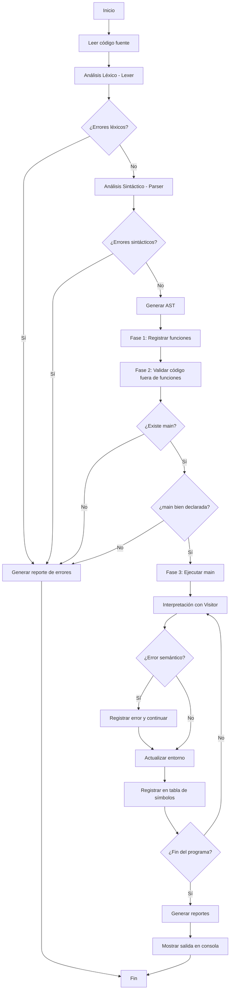
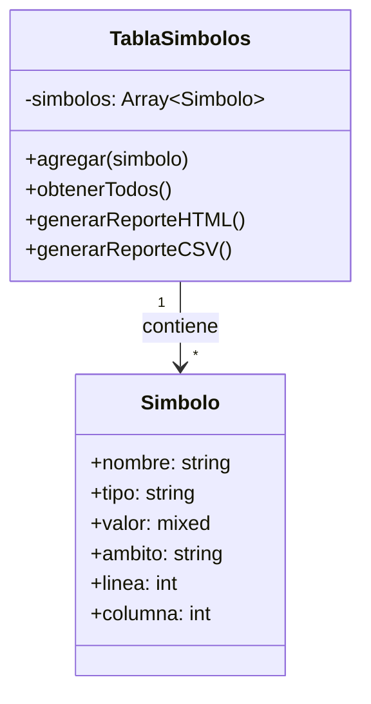

# Diagramas - Intérprete Golampi

## Diagrama de Clases

### Clases Principales del Intérprete

## Diagramas de Flujo de Procesamiento

### Flujo General de Ejecución

## Tabla de Símbolos

### Estructura de la Tabla de Símbolos

