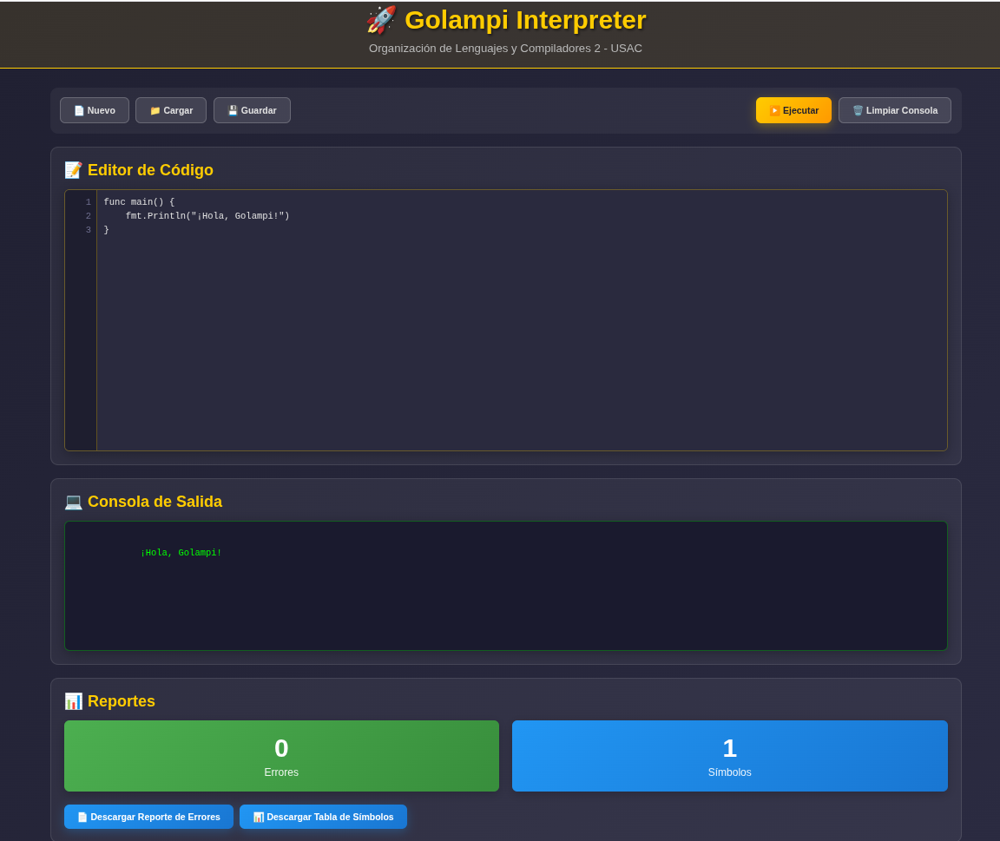

# Manual de Usuario - Intérprete Golampi

## Tabla de Contenidos

1. [Introducción](#introducción)
2. [Requisitos del Sistema](#requisitos-del-sistema)
3. [Instalación](#instalación)
4. [Uso de la Interfaz](#uso-de-la-interfaz)
5. [Crear y Editar Código](#crear-y-editar-código)
6. [Ejecutar Programas](#ejecutar-programas)
7. [Interpretar Reportes](#interpretar-reportes)
8. [Características del Lenguaje](#características-del-lenguaje)

---

## Introducción

### ¿Qué es Golampi?

Golampi es un lenguaje de programación educativo inspirado en Go, El intérprete de Golampi permite ejecutar programas directamente desde el navegador web.

---

## Requisitos del Sistema

### Software Necesario

| Requisito | Versión Mínima | Propósito |
|-----------|----------------|-----------|
| **PHP** | 8.0 o superior | Ejecutar el intérprete |
| **Java** | 8 o superior | Regenerar parser ANTLR (opcional) |
| **Navegador Web** | Chrome 90+, Firefox 88+, Edge 90+ | Interfaz de usuario |
| **Composer** | 2.0+ | Gestión de dependencias |

### Hardware Mínimo

- **Procesador**: 1 GHz o superior
- **RAM**: 512 MB disponibles
- **Almacenamiento**: 50 MB libres

---

## Instalación

### Paso 1: Descargar el Proyecto

#### Opción A: Desde un archivo comprimido

```bash
# Descomprimir el archivo
unzip OLC2_Proyecto1_202203228.zip
cd OLC2_Proyecto1_202203228
```

#### Opción B: Clonar desde repositorio

```bash
# Clonar el repositorio
git clone [URL_DEL_REPOSITORIO]
cd OLC2_Proyecto1_202203228
```

---

### Paso 2: Instalar Dependencias

```bash
# Instalar dependencias de Composer
composer install
```

**Nota**: Si no tienes Composer instalado, descárgalo desde [getcomposer.org](https://getcomposer.org)

---

### Paso 3: Verificar Instalación de PHP

```bash
# Verificar versión de PHP
php -v

# Debe mostrar algo como:
# PHP 8.1.2 (cli) (built: Jan 20 2022 10:00:00)
```

Si no tienes PHP instalado:

**En Ubuntu/Debian:**
```bash
sudo apt update
sudo apt install php php-cli php-mbstring
```

**En Windows:**
- Descargar desde [php.net](https://www.php.net/downloads)
- Agregar PHP al PATH del sistema

**En macOS:**
```bash
brew install php
```

---

### Paso 4: Iniciar el Servidor

```bash
# Iniciar servidor PHP en el puerto 8080
php -S 0.0.0.0:8080
```

**Salida esperada:**
```
PHP 8.1.2 Development Server (http://0.0.0.0:8080) started
```

---

### Paso 5: Abrir la Aplicación

1. Abrir navegador web
2. Ir a: **http://0.0.0.0:8080**
3. Debe aparecer la interfaz del intérprete

---

## Uso de la Interfaz

### Vista General de la Interfaz

La interfaz está dividida en 4 secciones principales:



### Componentes de la Interfaz

#### 1. Barra de Herramientas

| Botón | Función |
|-------|---------|
| **Nuevo** | Limpiar el editor de codigo |
| **Cargar** | Cargar un archivo al editor |
| **Guardar** | Guarda los cambios al archivo o se crea uno nuevo |
| **Ejecutar** | Interpreta y ejecuta el código |
| **Limpiar** | Borra el contenido del editor |
| **Descargar Tabla de Símbolos** | Descarga reporte HTML de símbolos |
| **Descargar Reporte de Errores** | Descarga reporte HTML de errores |

#### 2. Editor de Código

- **Números de línea**: Facilitan la referencia a errores
- **Sintaxis básica**: Área de texto con formato monoespaciado
- **Scroll**: Para código extenso
- **Editable**: Click para comenzar a escribir

#### 3. Consola de Salida

- **Salida estándar**: Muestra resultados de `fmt.Println()`
- **Mensajes de error**: Errores semánticos durante la ejecución
- **Formato plano**: Sin colores, texto simple
- **No editable**: Solo lectura

---

## Crear y Editar Código

### Paso 1: Escribir un Programa Básico

1. **Click en el editor de código**
2. **Escribir el programa**:

```go
func main() {
    fmt.Println("¡Hola, Golampi!")
}
```

### Paso 2: Características del Editor

#### Números de Línea
- Se muestran automáticamente a la izquierda
- No son parte del código (no se copian)
- Útiles para identificar errores

#### Tabulación
- Presionar **Tab** para indentar
- Usar **espacios** para alineación

#### Copiar y Pegar
- **Ctrl+C** / **Cmd+C**: Copiar
- **Ctrl+V** / **Cmd+V**: Pegar
- **Ctrl+A** / **Cmd+A**: Seleccionar todo

---

### Paso 3: Declarar Variables

```go
func main() {
    // Declaración con tipo e inicialización
    var edad int32 = 25
    var nombre string = "Juan"
    
    // Declaración con tipo (valor por defecto)
    var precio float32
    
    // Declaración corta (tipo inferido)
    ciudad := "Guatemala"
    
    // Constante
    const PI float32 = 3.14159
    
    fmt.Println("Nombre:", nombre)
    fmt.Println("Edad:", edad)
}
```

---

### Paso 4: Usar Estructuras de Control

#### If/Else

```go
func main() {
    edad := 18
    
    if edad >= 18 {
        fmt.Println("Eres mayor de edad")
    } else {
        fmt.Println("Eres menor de edad")
    }
}
```

#### For Loop

```go
func main() {
    // For tradicional
    for i := 0; i < 5; i++ {
        fmt.Println("Iteración:", i)
    }
    
    // While (for condicional)
    x := 0
    for x < 3 {
        fmt.Println("x =", x)
        x++
    }
    
    // Loop infinito
    contador := 0
    for {
        if contador >= 2 {
            break
        }
        fmt.Println("Infinito:", contador)
        contador++
    }
}
```

#### Switch

```go
func main() {
    dia := 3
    
    switch dia {
    case 1:
        fmt.Println("Lunes")
    case 2:
        fmt.Println("Martes")
    case 3, 4, 5:
        fmt.Println("Mitad de semana")
    default:
        fmt.Println("Fin de semana")
    }
}
```

---

### Paso 5: Crear Funciones

#### Función Simple

```go
func saludar() {
    fmt.Println("¡Hola!")
}

func main() {
    saludar()
}
```

#### Función con Parámetros

```go
func sumar(a int32, b int32) int32 {
    return a + b
}

func main() {
    resultado := sumar(10, 20)
    fmt.Println("Suma:", resultado)
}
```

#### Función con Múltiple Retorno

```go
func operaciones(a int32, b int32) (int32, int32) {
    suma := a + b
    resta := a - b
    return suma, resta
}

func main() {
    s, r := operaciones(15, 5)
    fmt.Println("Suma:", s, "Resta:", r)
}
```

---

### Paso 6: Trabajar con Arreglos

#### Declaración de Arreglos

```go
func main() {
    // No inicializado (valores por defecto)
    var numeros [5]int32
    
    // Inicializado
    precios := [3]float32{10.5, 20.0, 15.75}
    
    // Acceso
    fmt.Println("Primer precio:", precios[0])
    
    // Modificación
    numeros[2] = 100
    fmt.Println("Número modificado:", numeros[2])
}
```

#### Arreglos Multidimensionales

```go
func main() {
    // Matriz 2x2
    matriz := [2][2]int32{
        {1, 2},
        {3, 4}
    }
    
    fmt.Println("Elemento [0][1]:", matriz[0][1])
    
    // Modificar
    matriz[1][1] = 99
    fmt.Println("Nuevo valor [1][1]:", matriz[1][1])
}
```

---

### Paso 7: Usar Punteros

```go
func duplicar(x *int32) {
    x = x * 2
}

func main() {
    numero := 10
    fmt.Println("Antes:", numero)
    
    duplicar(&numero)
    fmt.Println("Después:", numero)
}
```

## Ejecutar Programas

1. **Escribir el código en el editor**
2. **Click en el botón "▶ Ejecutar"**
3. **Ver resultados en la consola**


---

### Ejemplo de Ejecución Exitosa

**Código:**
```go
func main() {
    fmt.Println("=== Programa de Prueba ===")
    x := 10
    y := 20
    fmt.Println("x + y =", x + y)
}
```

**Salida en Consola:**
```
=== Programa de Prueba ===
x + y = 30
```

---

### Ejemplo de Ejecución con Error

**Código:**
```go
func main() {
    x := 10
    y = 20  // Error: 'y' no declarado
    fmt.Println(x + y)
}
```

**Salida en Consola:**
```
Se encontraron 1 errore(s):
  [Semántico] Línea 3, Columna 4: Variable 'y' no definida
```

---

## Interpretar Reportes

### Tabla de Símbolos

La tabla de símbolos muestra todas las variables y funciones declaradas durante la ejecución.

#### Generar Reporte de Tabla de Símbolos

1. **Ejecutar un programa**
2. **Click en "↓ Descargar Tabla de Símbolos"**
3. **Se descarga un archivo HTML**
4. **Abrir el archivo en el navegador**

---

#### Estructura del Reporte

El reporte HTML incluye una tabla con las siguientes columnas:

| Columna | Descripción | Ejemplo |
|---------|-------------|---------|
| **Nombre** | Identificador de la variable/función | `edad`, `sumar`, `PI` |
| **Tipo** | Tipo de dato | `int32`, `float32`, `function` |
| **Valor** | Valor almacenado | `25`, `3.14`, `[Función]` |
| **Ámbito** | Dónde fue declarado | `global`, `main`, `sumar` |
| **Línea** | Número de línea en el código | `5` |
| **Columna** | Posición en la línea | `8` |

---

#### Ejemplo de Tabla de Símbolos

**Código:**
```go
var pi float32 = 3.14

func calcular(x int32) int32 {
    resultado := x * 2
    return resultado
}

func main() {
    numero := 10
    res := calcular(numero)
    fmt.Println("Resultado:", res)
}
```

**Tabla de Símbolos Generada:**

| Nombre | Tipo | Valor | Ámbito | Línea | Columna |
|--------|------|-------|--------|-------|---------|
| pi | float32 | 3.14 | global | 1 | 4 |
| calcular | function | [Función] | global | 3 | 5 |
| main | function | [Función] | global | 8 | 5 |
| x | int32 | 10 | calcular | 3 | 15 |
| resultado | int32 | 20 | calcular | 4 | 4 |
| numero | int32 | 10 | main | 9 | 4 |
| res | int32 | 20 | main | 10 | 4 |

---

#### Interpretar la Tabla de Símbolos

**Ámbitos:**
- `global`: Variables y funciones a nivel de programa
- `main`: Variables dentro de la función main
- `nombreFunción`: Variables dentro de funciones específicas
- `bloque`: Variables dentro de if/for/switch
- `for`: Variables declaradas en el inicializador de for

**Tipos:**
- Primitivos: `int32`, `float32`, `bool`, `rune`, `string`
- Compuestos: `[3]int32` (arreglo de 3 enteros)
- Especiales: `function`, `nil`

**Valores:**
- Para variables: el valor actual almacenado
- Para funciones: `[Función]`
- Para arreglos: representación del arreglo completo

---

### Reporte de Errores

El reporte de errores muestra todos los problemas detectados durante el análisis y la ejecución.

#### Generar Reporte de Errores

1. **Ejecutar un programa (con o sin errores)**
2. **Click en "↓ Descargar Reporte de Errores"**
3. **Se descarga un archivo HTML**
4. **Abrir el archivo en el navegador**

---

#### Tipos de Errores

##### 1. Errores Léxicos

Detectados durante el análisis de tokens.

**Ejemplo:**
```go
func main() {
    x := 10@  // Carácter inválido '@'
}
```

**Reporte:**
```
[Léxico] Línea 2, Columna 12: Carácter no reconocido '@'
```

---

##### 2. Errores Sintácticos

Detectados cuando la estructura no coincide con la gramática.

**Ejemplo:**
```go
func main() {
    if x > 10  // Falta bloque '{ }'
        fmt.Println("Mayor")
}
```

**Reporte:**
```
[Sintáctico] Línea 2, Columna 14: Se esperaba '{' después de la condición
```

---

##### 3. Errores Semánticos

Detectados durante la interpretación.

**Ejemplos Comunes:**

| Error | Código | Mensaje |
|-------|--------|---------|
| Variable no declarada | `x = 10` (sin `var` o `:=`) | Variable 'x' no definida |
| Tipo incompatible | `var x int32 = "texto"` | No se puede asignar tipo 'string' a 'int32' |
| División por cero | `y := 10 / 0` | División por cero |
| Índice fuera de rango | `arr[10]` (arr tiene 5 elementos) | Índice fuera de rango: 10 |
| Función inexistente | `noExiste()` | Función 'noExiste' no definida |
| Main faltante | (no hay función main) | No se encontró la función 'main' |
| Aridad incorrecta | `sumar(10)` (espera 2 args) | La función espera 2 argumentos pero recibió 1 |

---

#### Estructura del Reporte de Errores

El reporte HTML incluye:

1. **Resumen**: Cantidad total de errores por tipo
2. **Tabla de errores**: Detalle de cada error

**Ejemplo de Tabla:**

| Tipo | Línea | Columna | Descripción |
|------|-------|---------|-------------|
| Semántico | 5 | 12 | Variable 'edad' no definida |
| Semántico | 8 | 4 | No se puede asignar tipo 'string' a variable 'numero' de tipo 'int32' |
| Semántico | 12 | 15 | División por cero |

---

#### Ejemplo Completo de Reporte de Errores

**Código con Errores:**
```go
func main() {
    var edad int32
    edad = "veinticinco"  // Error: tipo incompatible
    
    resultado := dividir(10, 0)  // Error: función no existe
    
    numero := 5
    fmt.Println(numbre)  // Error: variable mal escrita
}
```

**Reporte Generado:**

```
=== REPORTE DE ERRORES ===

Total de errores: 3

ERRORES SEMÁNTICOS (3):
  • Línea 3, Columna 11: No se puede asignar un valor de tipo 'string' 
    a la variable 'edad' de tipo 'int32'
  • Línea 5, Columna 17: Función 'dividir' no definida
  • Línea 8, Columna 16: Variable 'numbre' no definida
```

---

## Características del Lenguaje

### Tipos de Datos

| Tipo | Descripción | Ejemplo | Valor por Defecto |
|------|-------------|---------|-------------------|
| `int32` | Entero de 32 bits | `42`, `-10` | `0` |
| `float32` | Punto flotante | `3.14`, `-0.5` | `0.0` |
| `bool` | Booleano | `true`, `false` | `false` |
| `string` | Cadena de texto | `"Hola"` | `""` |
| `rune` | Carácter único | `'A'`, `'5'` | `'\0'` |

---

### Operadores

#### Aritméticos

| Operador | Operación | Ejemplo | Resultado |
|----------|-----------|---------|-----------|
| `+` | Suma | `5 + 3` | `8` |
| `-` | Resta | `5 - 3` | `2` |
| `*` | Multiplicación | `5 * 3` | `15` |
| `/` | División | `6 / 2` | `3` |
| `%` | Módulo | `7 % 3` | `1` |

#### Relacionales

| Operador | Comparación | Ejemplo | Resultado |
|----------|-------------|---------|-----------|
| `==` | Igual | `5 == 5` | `true` |
| `!=` | Diferente | `5 != 3` | `true` |
| `<` | Menor | `3 < 5` | `true` |
| `<=` | Menor o igual | `5 <= 5` | `true` |
| `>` | Mayor | `5 > 3` | `true` |
| `>=` | Mayor o igual | `5 >= 5` | `true` |

#### Lógicos

| Operador | Operación | Ejemplo | Resultado |
|----------|-----------|---------|-----------|
| `&&` | AND | `true && false` | `false` |
| `\|\|` | OR | `true \|\| false` | `true` |
| `!` | NOT | `!true` | `false` |

**Nota**: Los operadores `&&` y `||` usan **evaluación en cortocircuito**.

#### Incremento/Decremento

| Operador | Operación | Ejemplo |
|----------|-----------|---------|
| `++` | Incremento | `x++` |
| `--` | Decremento | `x--` |

#### Asignación Compuesta

| Operador | Equivalente | Ejemplo |
|----------|-------------|---------|
| `+=` | `x = x + y` | `x += 5` |
| `-=` | `x = x - y` | `x -= 3` |
| `*=` | `x = x * y` | `x *= 2` |
| `/=` | `x = x / y` | `x /= 4` |

---

### Funciones Embebidas

#### len(valor)

Retorna la longitud de un string o arreglo.

```go
func main() {
    texto := "Golampi"
    numeros := [5]int32{1, 2, 3, 4, 5}
    
    fmt.Println("Longitud del texto:", len(texto))     // 7
    fmt.Println("Tamaño del arreglo:", len(numeros))   // 5
}
```

---

#### typeOf(valor)

Retorna el tipo de una variable como string.

```go
func main() {
    x := 42
    y := 3.14
    z := "texto"
    arr := [3]int32{1, 2, 3}
    
    fmt.Println(typeOf(x))    // int32
    fmt.Println(typeOf(y))    // float32
    fmt.Println(typeOf(z))    // string
    fmt.Println(typeOf(arr))  // [3]int32
}
```

---

#### now()

Retorna la fecha y hora actual en formato `YYYY-MM-DD HH:MM:SS`.

```go
func main() {
    fechaActual := now()
    fmt.Println("Fecha y hora:", fechaActual)
    // Salida: Fecha y hora: 2026-03-12 15:30:45
}
```

---

#### substr(texto, inicio, longitud)

Extrae una subcadena.

```go
func main() {
    texto := "Universidad San Carlos"
    
    parte1 := substr(texto, 0, 11)   // "Universidad"
    parte2 := substr(texto, 12, 10)  // "San Carlos"
    
    fmt.Println(parte1)
    fmt.Println(parte2)
}
```

---

### Módulo fmt

#### fmt.Println(args...)

Imprime argumentos separados por espacios con salto de línea.

```go
func main() {
    nombre := "Ana"
    edad := 25
    
    fmt.Println("Nombre:", nombre, "Edad:", edad)
    // Salida: Nombre: Ana Edad: 25
}
```